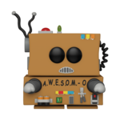

## Welcome!

We're so glad you're thinking about contributing to an 18F open source project! If you're unsure about anything, just ask -- or submit the issue or pull request anyway. The worst that can happen is you'll be politely asked to change something. We love all friendly contributions.

We want to ensure a welcoming environment for all of our projects. Our staff follow the [18F Code of Conduct](https://github.com/18F/code-of-conduct/blob/master/code-of-conduct.md) and all contributors should do the same.

We encourage you to read this project's CONTRIBUTING policy (you are here), its [LICENSE](LICENSE.md), and its [README](README.md).

If you have any questions or want to read more, check out the [18F Open Source Policy GitHub repository](https://github.com/18f/open-source-policy), or just [shoot us an email](mailto:18f@gsa.gov).

## Development

Charlie is a Slack App, and for structural and policy reasons described below, it can't be fully qualified and exercised in a local development environment.

Because Slack apps work by responding to web hooks rather than setting up a persistent websocket connection, the machine where Charlie runs cannot respond to Slack events unless it is accessible on the public internet over HTTPS. **GSA policy forbids our computers from doing this**. As a result, it is necessary to run the app in cloud.gov to test it.

To facilitate this requirement, there is a `GSA TTS Testing` Slack instance available to test in-development changes to Charlie before deploying to production. The Slack instance `GSA TTS Testing` is deployed in cloud.gov and this github repository is fully wired up with CI/CD to automatically deploy to it (for branches other than `main`).

### Anatomy of developing and deplolying a New Charlie Bot

For a new bot called `awesomobot`, this is the general flow:



- Write the core bot functionality in a file name `src/scripts/awesomobot.js`
- Write an accompanying `src/scripts/awesomobot.test.js` file is required that contains relevant unit tests.
- Docker can and should be used for local linting and unit testing.
- `GSA TTS Testing` Slack can and should be used for live testing of `awesomobot`.
- Iterate as needed
- When feature complete and tested, file a Pull Request and get someone to review ([#bots](https://app.slack.com/client/T025AQGAN/C02FPFGBG) in Slack is a good place to start that discussion).
- After PR is reviewed, approved, and merged to `main`, deployment to TTS Slack is automatic via CI/CD hooks.

#### Using Docker for Local Linting and Unit Testing

Make sure Docker is installed locally and the daemon is running.

Start up the container:

```bash
docker-compose up
```

This will get all of Charlie's dependencies installed, set up a PostgreSQL container, hook up Charlie and postgres, and start Charlie. In this configuration, Charlie is run using [nodemon](https://npm.im/nodemon), so it will automatically restart if you make any code changes.

Run linter and tests:

```bash
docker-compose exec charlie npm run lint
docker-compose exec charlie npm test
```

_tip_: the above will test all unit tests across Charlie. To shorten iteration cycles, you can _temporarily_ change a regex from the top-level file `package.json` (don't commit this change) to _only_ test your code.

change this:

`"test": "jest 'src/.+/?.+\\.test\\.js'",`

to something like this:

`"test": "jest 'src/scripts/awesomobot\\.test\\.js'",`

#### Deploying to `GSA TTS Testing` Slack

Steps to get wired up to `GSA TTS Testing` Slack:

- Ask for assistance in the [#bots](https://app.slack.com/client/T025AQGAN/C02FPFGBG) channel.
- Contact an admin of `GSA TTS Testing` Slack about getting added as a user.
- Also get added to the `gsa-18f-hubot` group in cloud.gov if you aren't already. If you're new to this, [get signed up and familiar with the cloud.gov here](https://cloud.gov/sign-up/).

After the above is taken care of, use `cf` to login to `cloud.gov` and connect to the `gsa-18f-hubot` org and select the space as `dev`.

Interaction should look something like this:

```
➜ cf login -a api.fr.cloud.gov  --sso
API endpoint: api.fr.cloud.gov

Temporary Authentication Code ( Get one at https://login.fr.cloud.gov/passcode ):
Authenticating...
OK


Select an org:
1. gsa-18f-hubot
2. sandbox-gsa

Org (enter to skip): 1
Targeted org gsa-18f-hubot.

Select a space:
1. dev
2. prod
3. staging

Space (enter to skip): 1
Targeted space dev.

API endpoint:   https://api.fr.cloud.gov
API version:    3.107.0
user:           <username>@gsa.gov
org:            gsa-18f-hubot
space:          dev
```

At any point you can make sure you are connected to the right org and space with:

    cf target -o gsa-18f-hubot -s dev

Finally, to deploy your development branch to `GSA TTS Testing` Slack, execute this command:

    cf push --vars-file ./dev.yml

Note: it takes a few minutes for the code to fully build and deploy. The console should give updates of its progress and exit to a prompt when finished.

#### Getting the New Bot Deployed to Production

After `awesomobot` has been linted, unit tested, live tested on `GSA TTS Testing` Slack, and deemed production-ready, the process to get the new bot to `TTS` Slack is as follows:

- Push your `awesomo` branch to github.com/18F/Charlie
- File a Pull Request for `awesomo->main`
  -- PR should be from your development
  -- Include an explanatory paragraph in the PR as to what's in the request.
- Request a reviewer. If you don't know who should review the code, ask in the [#bots](https://app.slack.com/client/T025AQGAN/C02FPFGBG) channel
- After PR has passed review, merge the changes to `main` (sometimes the reviewer does this)
  -- CI/CD is setup so the deployment to `TTS` Slack is automatic
- Confirm in production Slack that the bot is functional and works as designed.

## Public domain

This project is in the worldwide [public domain](LICENSE.md).

This project is in the public domain within the United States, and copyright and related rights in the work worldwide are waived through the [CC0 1.0 Universal public domain dedication](https://creativecommons.org/publicdomain/zero/1.0/).

All contributions to this project will be released under the CC0 dedication. By submitting a pull request, you are agreeing to comply with this waiver of copyright interest.
